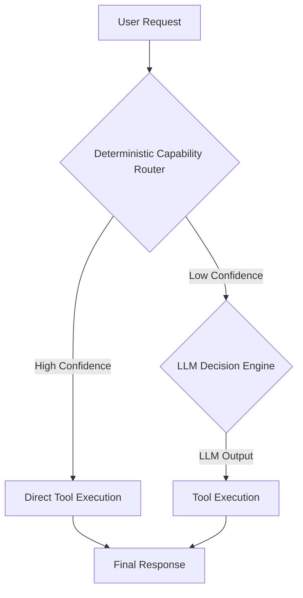

# ADR-004: Hybrid Intelligence Architecture (Proposed)

## Status

Proposed

## Context

Phase 3A has established a stable, deterministic agent runtime foundation (v3.0.0). This ADR outlines the proposed architecture for Phase 3B, focusing on integrating Large Language Models (LLMs) to introduce hybrid intelligence while preserving the core principles of determinism and replayability where applicable. The primary goal is to enable intelligent decision-making for capability routing and planning, with a clear deterministic fallback strategy.

## Decision

We will introduce a hybrid intelligence architecture that leverages LLMs for nuanced decision-making, particularly in scenarios where the deterministic router has low confidence. A strict boundary will be maintained between the deterministic runtime and LLM-driven components to ensure replayability and testability.

### Deterministic Fallback Strategy

The core principle of the hybrid intelligence architecture is to prioritize deterministic routing and planning. LLMs will only be invoked when the deterministic `CapabilityRouter` expresses low confidence in matching a user prompt to an available tool. This ensures that the agent's behavior remains predictable and auditable for high-confidence scenarios.



### LLM Boundary Interfaces

To maintain a clear separation of concerns and enable future LLM provider interchangeability, we will define specific interfaces for interacting with LLMs. These interfaces will abstract away the complexities of different LLM APIs and ensure that the core runtime remains agnostic to the underlying LLM implementation.

#### `ModelProvider` Interface

This interface defines the contract for interacting with various LLM providers. It will encapsulate methods for sending prompts and receiving responses, handling authentication, and managing rate limits.

```typescript
interface ModelProvider {
  /**
   * Sends a prompt to the LLM and returns its response.
   * @param prompt The prompt to send to the LLM.
   * @param options Optional parameters for the LLM call (e.g., temperature, max_tokens).
   * @returns A promise that resolves to the LLM's response.
   */
  generate(prompt: string, options?: ModelCallOptions): Promise<ModelResponse>;

  /**
   * Returns metadata about the LLM provider, such as available models and capabilities.
   */
  getMetadata(): ModelProviderMetadata;
}

interface ModelCallOptions {
  temperature?: number;
  maxTokens?: number;
  stopSequences?: string[];
  // Add other common LLM parameters as needed
}

interface ModelResponse {
  text: string;
  // Add other relevant response data (e.g., token usage, finish reason)
}

interface ModelProviderMetadata {
  name: string;
  models: Array<{ id: string; capabilities: string[] }>;
  // Add other relevant provider metadata
}
```

#### `PromptManager` Interface

This interface defines the contract for managing and rendering prompts for LLMs. It will allow for dynamic prompt construction based on context, history, and available tools, ensuring that LLMs receive well-formed and relevant input.

```typescript
interface PromptManager {
  /**
   * Renders a prompt for the LLM based on the current context and available tools.
   * @param context The current execution context.
   * @param availableTools A list of tools that the LLM can consider.
   * @returns The formatted prompt string.
   */
  renderPrompt(context: ExecutionContext, availableTools: Tool[]): string;

  /**
   * Parses the LLM's raw response into a structured LLMDecision.
   * @param llmResponse The raw text response from the LLM.
   * @returns A structured LLMDecision object.
   */
  parseResponse(llmResponse: string): LLMDecision;
}
```

### `LLMDecision` Schema

This schema defines the structured output expected from the LLM when it is invoked for decision-making. This structured output is crucial for the deterministic runtime to interpret the LLM's intent and proceed with tool execution.

```typescript
interface LLMDecision {
  /**
   * The type of decision made by the LLM (e.g., 'tool_selection', 'clarification', 'no_action').
   */
  type: 'tool_selection' | 'clarification' | 'no_action' | 'reflection_override';

  /**
   * If type is 'tool_selection', the name of the tool selected by the LLM.
   */
  toolName?: string;

  /**
   * If type is 'tool_selection', the arguments for the selected tool.
   */
  toolArgs?: Record<string, unknown>;

  /**
   * Reasoning provided by the LLM for its decision.
   */
  reasoning: string;

  /**
   * Confidence score (0.0-1.0) assigned by the LLM to its decision.
   */
  confidence?: number;

  /**
   * If type is 'clarification', the question to ask the user.
   */
  clarificationQuestion?: string;

  /**
   * If type is 'reflection_override', the new reflection decision.
   */
  reflectionOverride?: ReflectionDecisionType;
}
```

### Confidence Threshold Contracts

We will define clear confidence threshold contracts to govern when the LLM is invoked and how its decisions are integrated into the deterministic flow. These thresholds will be configurable and auditable.

```typescript
interface ConfidenceThresholds {
  /**
   * The minimum confidence score required from the deterministic router to proceed directly to tool execution.
   * If the router's confidence falls below this, the LLM will be consulted.
   */
  routerMinConfidence: number;

  /**
   * The minimum confidence score required from the LLM for its tool selection to be accepted.
   * If the LLM's confidence falls below this, a clarification might be sought or a default action taken.
   */
  llmMinConfidence: number;

  /**
   * The confidence score below which the LLM should ask for clarification from the user.
   */
  clarificationThreshold: number;
}

const DEFAULT_CONFIDENCE_THRESHOLDS: ConfidenceThresholds = {
  routerMinConfidence: 0.7, // 70% confidence for direct execution
  llmMinConfidence: 0.6,    // 60% confidence for LLM-selected tool
  clarificationThreshold: 0.4, // Below 40%, ask for clarification
};
```

## Consequences

- **Improved Flexibility**: The agent will be able to handle a wider range of user prompts, including ambiguous or novel requests, by leveraging LLM intelligence.
- **Preserved Determinism**: The clear fallback strategy and boundary interfaces ensure that the core deterministic runtime remains intact and testable.
- **Maintainability**: Abstracting LLM interactions behind interfaces will make it easier to swap out different LLM providers or update prompt engineering strategies in the future.
- **Increased Complexity**: The overall system architecture will become more complex due to the introduction of LLM components and their integration points.
- **Performance Overhead**: LLM invocations will introduce latency and computational cost, which needs to be managed and optimized.

## Next Steps

- Implement the `ModelProvider` and `PromptManager` interfaces with mock or placeholder implementations.
- Integrate the `LLMDecision` schema into the planning and execution flow.
- Develop tests for the confidence threshold logic and LLM fallback scenarios.
